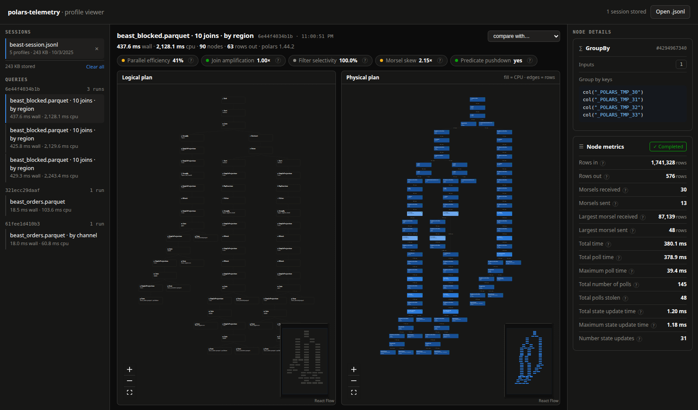

# Profile viewer

The viewer reads the `.jsonl` files the [JSONL exporter](exporters/jsonl.md)
and `profile()` write, and shows both plans of each query with every counter.

[Open the viewer](viewer/index.html), then drag one or more `.jsonl` files onto
the page, or use **Open .jsonl**.

**Nothing is uploaded.** Files are read in your browser. The page makes no
requests except to fetch an example from this site when you ask for one.

## Try it

The empty viewer offers one-click example sessions: the TPC-H queries at
scale factor 1 and 10, labelled `tpch/q1`, `tpch/q2` and so on. For a viewer
opened from disk, they are in the repository's
[`examples/`](https://github.com/jan-krueger/polars-telemetry/tree/main/examples).

## Sessions

Each opened file becomes a session, stored in your browser and kept across
reloads. Opening a file that is already stored switches to it instead of
storing it twice. Only the open session is read into memory, so many stored
sessions do not slow opening.

| Control | Does |
| --- | --- |
| Session name, top of the left sidebar | lists the most recently opened sessions |
| **All sessions**, in that menu, or the "sessions stored" count at the top | lists every session with its size and last-opened time; search, sort by name, size or date, select several to remove |
| Double-click a name, or F2 on it | renames the session |
| Download button | saves the session as a `.jsonl` again |

Where the browser keeps nothing, such as in a private window or with the page
opened from disk, the viewer works for the current page only and says so.

## Finding a query

The session overview lists each query shape (the runs of one query) with its
total and mean times. Click a column header to sort.

Queries are titled by their [label](labels.md), or else by the first table they
read. Search matches labels, file names, tables and fingerprints.

The address bar follows the screen, so reload and back work. That URL opens
only in the browser where the session was imported.

## Reading a plan

Above the plans, a query shows:

- wall time;
- average busy threads (node CPU ÷ wall time, as a bar against Polars' thread
  count);
- rows returned.

Hover the figures for exact times, planning and CPU.

A selected node's metrics open with derived figures: the share of rows a filter
kept, a join's rows out against its larger input, and how uneven its batches
were.

The logical plan is on the left, the physical plan on the right. Drag to pan,
scroll to zoom; the minimap shows where you are.

- **Logical plan**: the plan as written, with your own column names.
- **Physical plan**: what ran. Nodes are shaded by their share of CPU time,
  edges are labelled with rows, and a dot shows whether each node finished.
  Polars renames grouped columns to `_POLARS_TMP_N` here.

Click a node for its properties and every counter in the right sidebar. Each
counter's `?` explains what it measures. Long expressions are set one method
call or condition per line.

The slider above the physical plan fades the cheapest nodes still lit, one
step at a time; the readout gives how many remain and their share of CPU time.
The setting carries over to the next query as that share, not as a node count.

## Findings

Profiles written with [insights](insights.md), the default, carry what slows
each query down.

- The physical plan's header counts the warnings; its arrows step through them,
  zoomed in close enough to read.
- A node with a warning gets a badge and an outline that stays visible when a
  large plan is zoomed far out; the minimap marks it too.
- The node's details open with each finding: evidence, cost, a fix and a link
  to the rule.

Profiles written before 0.6.0, or with `Config(insights=False)`, show none;
`polars-telemetry insights FILE --write OUT` adds them.

## Comparing runs

When a query ran more than once, pick another run under **compare with…** and
every figure gains its change in percent.

## Sharing a query

**Copy link** puts the query on screen, and the run it is compared with, into a
link. The profiles travel after the `#`, which browsers never send to a server:
the recipient sees the same plans and nothing is uploaded.

A link opens as a session named after its query, marked *opened from a link,
not stored*. **Keep** stores it like an opened file, under whatever name you
gave it.

Anyone with the link can read everything in those profiles, and chat tools and
browser history keep it. For a profile not [masked](privacy.md) before export,
the viewer asks before copying. Profiles too large for a link get no link:
download the session and send the file.

